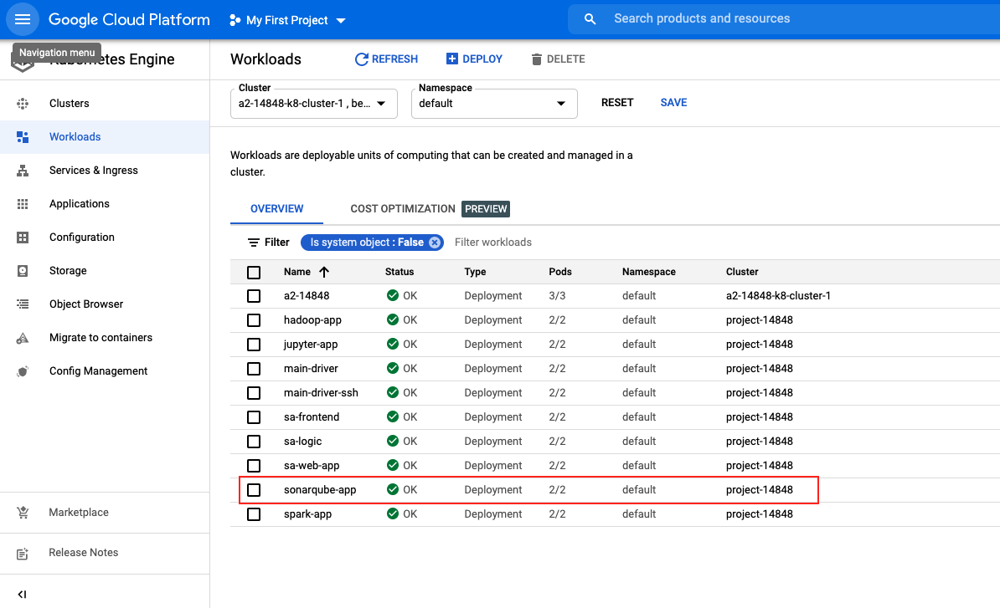
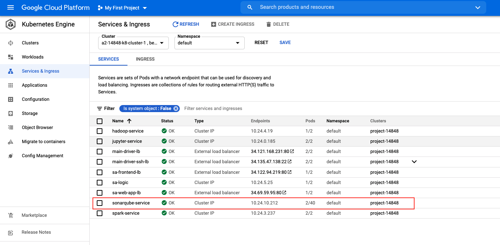

# 14848_cloud_infra_proj_sonarqube_sonarscanner

## How to build docker image
- Run `docker build --no-cache --progress=plain -t YOUR_DOCKER_ID/14848_proj_sonar:ubuntu . ` and push the image to DockerHub.

## Deploy docker image to Google Cloud Platform Kubernetes Cluster
- Open Cloud Shell on GCP and clone the repository:
```
git clone https://github.com/shihsunl/14848_cloud_infra_proj_sonarqube_sonarscanner.git
```
- Modify docker image in `resource-manifests/sonarqube_deployment.yaml`.
- Execute 2 yaml file in resource-manifests folder.
```
cd 14848_cloud_infra_proj_sonarqube_sonarscanner/resource-manifests/
kubectl apply -f sonarqube_deployment.yaml 
kubectl create -f service-sonarqube.yaml
```
- Then, you can check Workloads and Service & Ingress



- Next, you can access to the Service Website and select the sonarqube and sonarscanner service. Please check: `https://github.com/shihsunl/14848_cloud_infra_proj_driver`

## RESTful API Server
- Please check `server.py`
- You can use API `http://{FrontEnd_Website_Public_IP}/{BASE_URL}/scanrun` to trigger SonarScanner.
    - Example:
    ```
    curl -X POST -F 'git_url=https://github.com/xxx/xxxxx.git' -F 'projectkey=YOUR_PROJECT_KEY' -F 'sources=PROJECT_NAME' -F 'token=xxxxxxxxx'  'http://{FrontEnd_Website_Public_IP}/{BASE_URL}/scanrun'

    curl -X POST -F 'git_url=https://github.com/shihsunl/14848_Cloud_Infra_HW3.git' -F 'projectkey=test76' -F 'token=3e7c17d0634217c9946d3cb994d299bd1a22fb59' -F 'sources=14848_Cloud_Infra_HW3' 'http://34.135.47.138/sonarscanner/scanrun'
    ```
